# Deploy Gitlab on ICp


###prepare the helm sever:

execute below commands:

```
helm init -c
```

Then copy the gitlab packages in /root/.helm/repository/local and start the helm serve(the pacakge can be download from [github](https://github.ibm.com/qiujian/cfc-charts/blob/icbc/gitlab-ce-0.1.7.tgz))

```
root@hchenk8s2:~/.helm/repository/local# helm serve --address 9.111.254.208:8879
Regenerating index. This may take a moment.
Now serving you on 9.111.254.208:8879
```


Add the URL in ICp repositories in System -> Reposistories


Install the Gitlab package from AppCenter

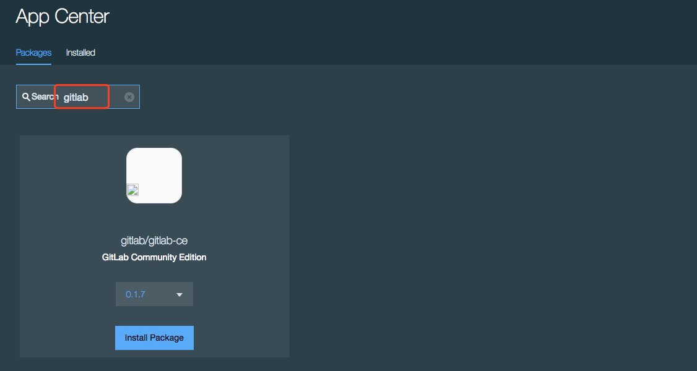
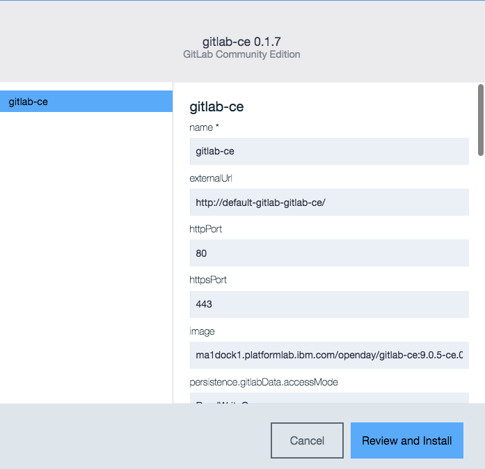

Check if the gitlab application was ready.

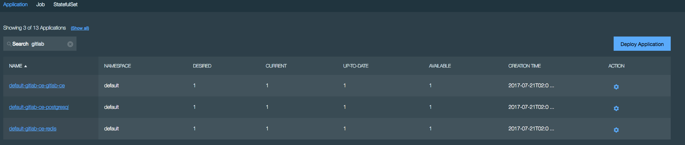


access the gitlab by click the link.

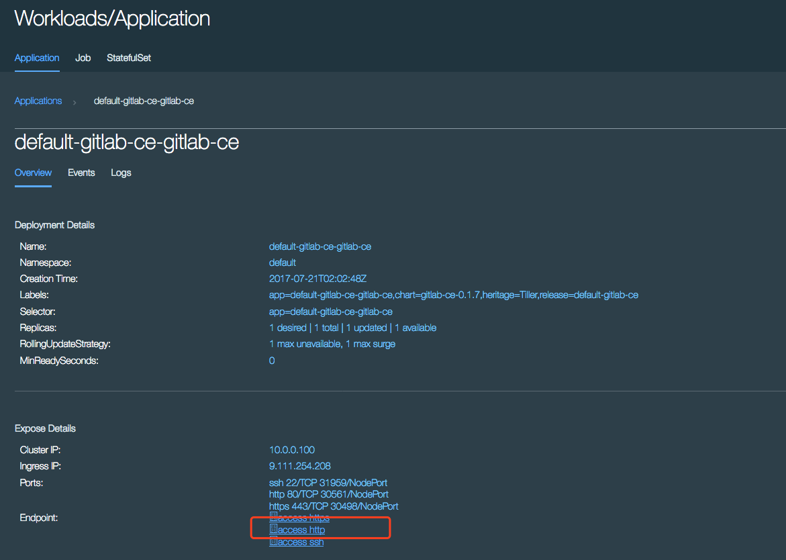

gitlab will ask for new password set.

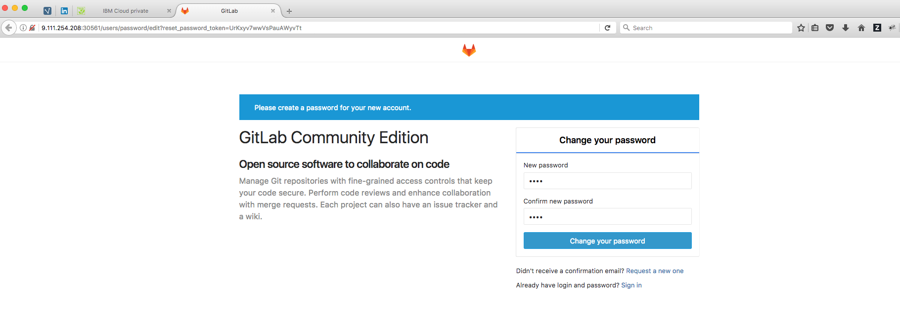

the we can login gitlab.

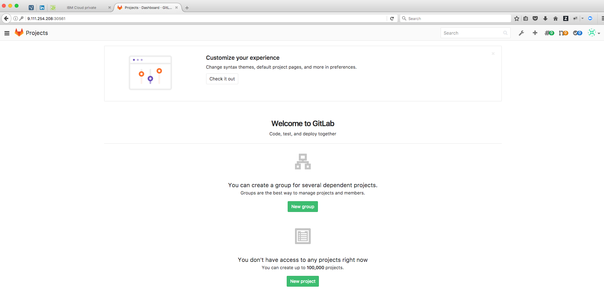


Then start to deploy the jenkins.

Click the appcenter and select the jenkins.

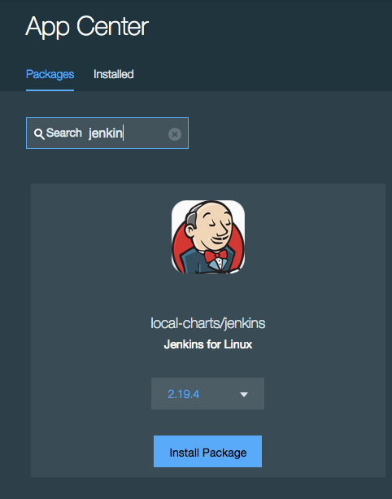

after the application deployed, in workloads -> application page, select the jenkins application and click the link of name to view the details.

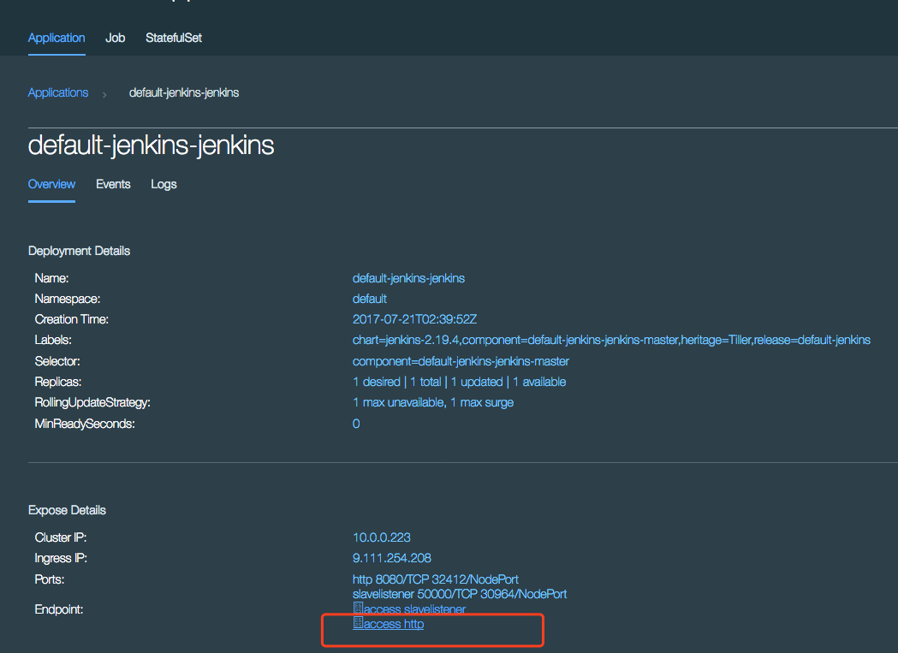
Click the endpoint link to open the jenkins UI


Then start to config the gitlab plugins


first install the gitlab plugins and the plugins can be download from [URL](https://wiki.jenkins.io/display/JENKINS/GitLab+Plugin)

create the api token on gitlab

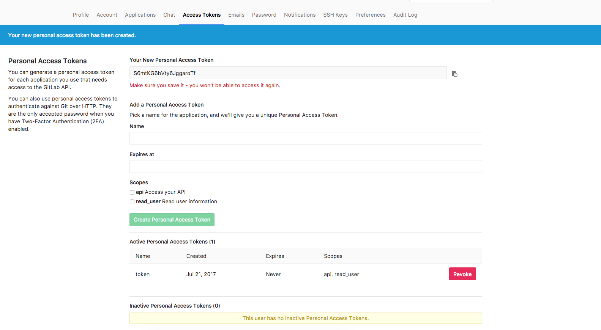
Add api token in jenkins


Then test the gitlab connection by click the button

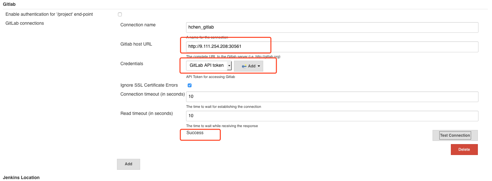

Create a sprintboot reposistory from [IBM Liberty](https://liberty-app-accelerator.wasdev.developer.ibm.com/start/) and clone the SprintBoot project


Add the Git project in jenkins

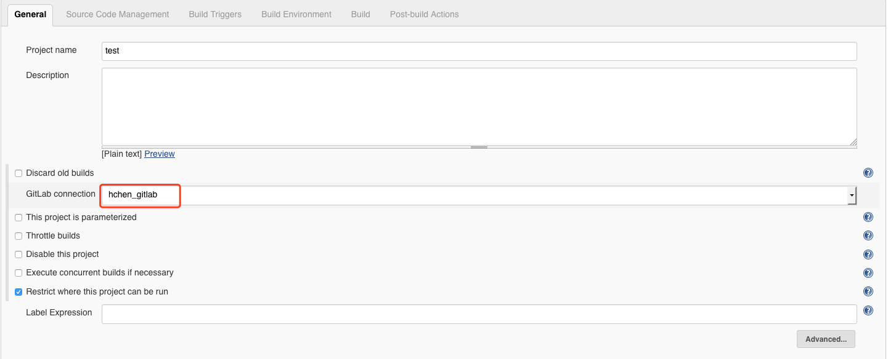
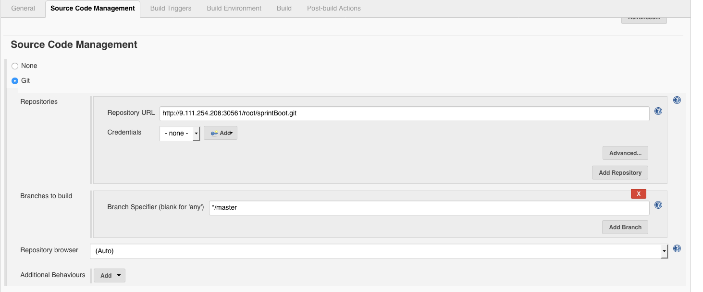
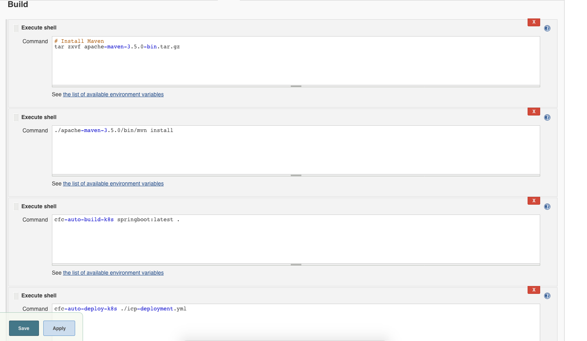

and save the project

Then we can start the build by trigger a jenkins job

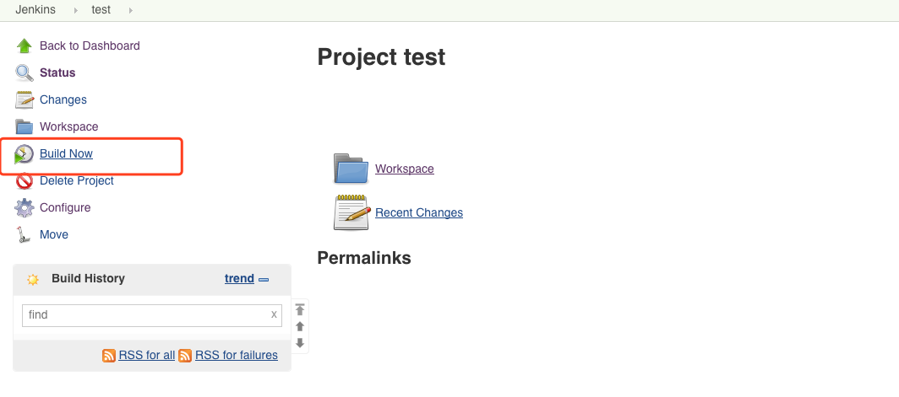


